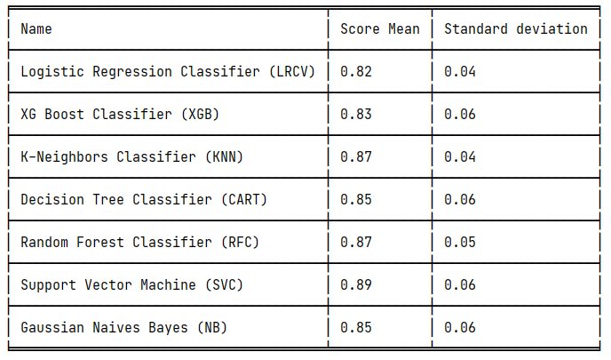

# ds-portfolio

# Recommender system
Using the movies dataset, we build a recommender system:
- based on videos popularity using IMDB weighted rating formula
- based on the similarity in the overview of videos

 Dataset [Here](https://www.kaggle.com/rounakbanik/the-movies-dataset/data)

 ## Results:
 ### 1-

 | title  | vote_count  | vote_average | score |
| :------------: |:---------------:|:---------------:|:---------------:|
| The Shawshank Redemption     | 8358.0 | 8.5 | 8.445869 |
| The Godfather	| 6024.0 | 8.5 | 8.425439 |
| Dilwale Dulhania Le Jayenge | 661.0	 | 9.1 | 8.421453 |
| .......................     | .....| ..... | .....|

### 2-

```python
get_recommendations('Father of the Bride Part II')
```
| title  | 
| :------------:|
| Father of the Bride |
| Kuffs 6024.0 |
| North to Alaska|
| Wendigo |
| The Magic of Méliès |
| .......................|

[x] We'll improve again the second part to take account others features like the director, actors, keywords and the movie genres.

## Results
```python
get_recommendations('Father of the Bride Part II', cosine_similarity)
```
| title  | 
| :------------:|
| Baby Boom |
| Father of the Bride |
| ¡Three Amigos! |
| Hanging Up |
| Das merkwürdige Verhalten geschlechtsreifer Gr... |
| .......................|


# Time serie analysis
***Making forecast with time serie. contains notes***

* Notes takes from [Here](https://www.bounteous.com/insights/2020/09/15/forecasting-time-series-model-using-python-part-one/)

For model-comparison-sarima-lstm-prophet, we have : 
| Models  | MEAN | RMSE  Errors  | MSE  Errors|
| :-------------: | :------------- | :-------------: | :-------------: |
|  SARIMA  |  148.42 |  8.14  | 66.18  |
|  LSTM  |  148.42 |  10.77  | 116.02  |
|  PROPHET  |  148.42 |  11.48  | 131.69  |

* Then SARIMA fit well (with simple tuning) to the monthly beer production dataset.

# Chosen algorithm
Given the type of model: classification or prediction, 
the **chosen** class will give several algorithms with their accuracy
</br>
That way we can save times for choosing the best algorithms :)


### Use-case

__From there__
```python
import pandas as pd
from sklearn.model_selection import train_test_split
from chosen.chosen import Chosen

data = pd.read_csv('data/Social_Network_Ads.csv')
X = data.iloc[:, -3:-1].values
y = data.iloc[:, -1].values
X_train, X_test, y_train, y_test = train_test_split(X, y, test_size=0.3, random_state=42)

model = Chosen(X_train, y_train, model_type='classification', scaling=True)
model.train()
```
__We got__


__Within the boxplot__


