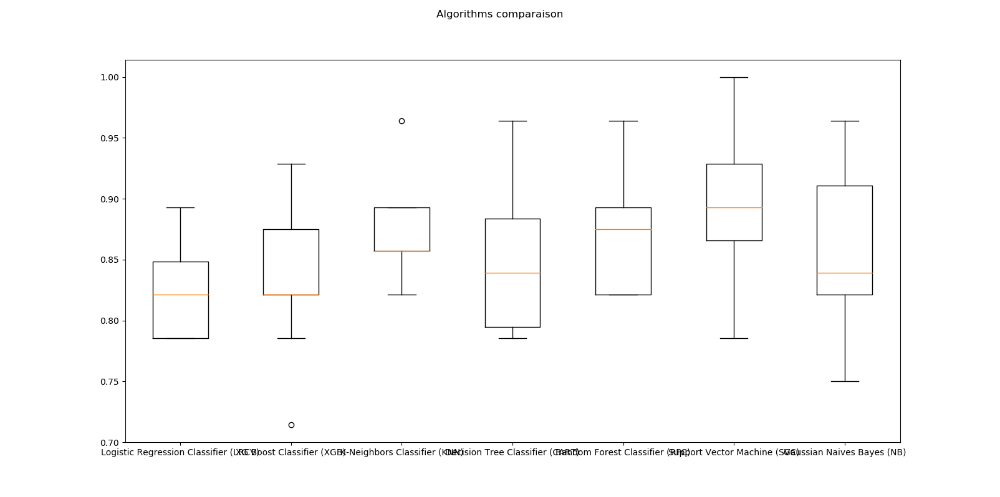

# Chosen algorithm
Given the type of model: classification or prediction, 
the **chosen** class will give several algorithms with their accuracy
</br>
That way we can save times for choosing the best algorithms :)


### Use-case

__From there__
```python
import pandas as pd
from sklearn.model_selection import train_test_split
from chosen.chosen import Chosen

data = pd.read_csv('data/Social_Network_Ads.csv')
X = data.iloc[:, -3:-1].values
y = data.iloc[:, -1].values
X_train, X_test, y_train, y_test = train_test_split(X, y, test_size=0.3, random_state=42)

model = Chosen(X_train, y_train, model_type='classification', scaling=True)
model.train()
```
__We got__


__Within the boxplot__


